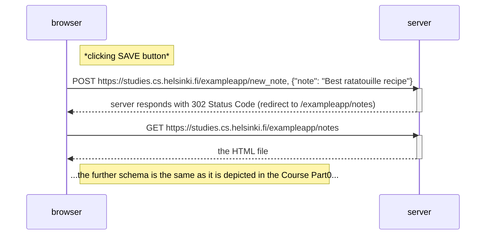

```mermaid
sequenceDiagram
    participant browser
    participant server

    Note right of browser:*clicking SAVE button*
    browser->>server: POST https://studies.cs.helsinki.fi/exampleapp/new_note, {"note": "Best ratatouille recipe"}
    activate server
    server-->>browser: server responds with 302 Status Code (redirect to /exampleapp/notes)
    deactivate server

    browser->>server: GET https://studies.cs.helsinki.fi/exampleapp/notes


    activate server
    server-->>browser: the HTML file
    deactivate server


    Note right of browser: ...the further schema is the same as it is depicted in the Course Part0...
```
