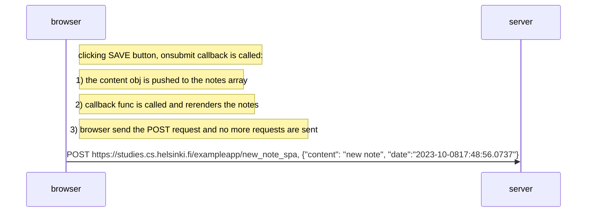

```mermaid
sequenceDiagram
    participant browser
    participant server

    Note right of browser: clicking SAVE button, onsubmit callback is called:
    Note right of browser: 1) the content obj is pushed to the notes array
    Note right of browser: 2) callback func is called and rerenders the notes
    Note right of browser: 3) browser send the POST request and no more requests are sent
    browser->>server: POST https://studies.cs.helsinki.fi/exampleapp/new_note_spa, {"content": "new note", "date":"2023-10-0817:48:56.0737"}
```
